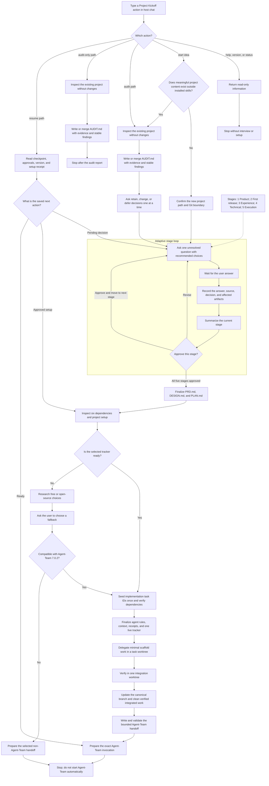
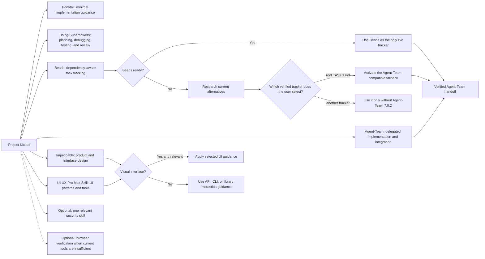

# Project Kickoff

Current version: **0.4.0**

```text
██████   ██████     ████   ████████ ████████   ██████ ████████
██    ██ ██    ██ ██    ██     ██   ██       ██         ████
██████   ██████   ██    ██     ██   ██████   ██         ████
██       ██  ██   ██    ██     ██   ██       ██         ████
██       ██    ██ ██    ██ ██  ██   ██       ██         ████
██       ██    ██   ████     ██     ████████   ██████   ████

██    ██ ████████   ██████ ██    ██   ████   ████████ ████████
██  ██     ████   ██       ██  ██   ██    ██ ██       ██
████       ████   ██       ████     ██    ██ ██████   ██████
████       ████   ██       ████     ██    ██ ██       ██
██  ██     ████   ██       ██  ██   ██    ██ ██       ██
██    ██ ████████   ██████ ██    ██   ████   ██       ██
```

Project Kickoff v0.4.0

Created by thebpandey.

Project Kickoff is a skill for Codex and Claude Code. It turns a software idea
into an approved product definition, design direction, technical blueprint, and
implementation plan. It prepares a minimal scaffold and an Agent-Team handoff.
It does not implement product features during kickoff.

The Skill supports new and existing web, mobile, desktop, API, CLI, and library
projects. It asks one question at a time. It records each answer and waits for
each required approval. It does not choose an unresolved stack or fallback
tracker for the user.

The package uses short sentences, one topic per sentence, and active voice. The
[official ASD-STE100 FAQ](https://www.asd-ste100.org/STE_faq.html) recommends
these principles for clear writing. The full standard is available free of
charge from its official downloads page. This README does not claim formal
certification or verified dictionary compliance.

## How the workflow operates

GitHub renders this Mermaid diagram as a graphical flowchart.



Each stage uses the same question loop. A timeout is not an answer. A direct user
decision is an answer. The Skill does not ask the user to approve the same
decision again. It asks only for the next unresolved consequence or stage bundle.

## Model and reasoning effort

On the first invocation in a conversation, the Skill asks one question. You pick
the model and the reasoning effort for two kinds of work:

- **Planning:** the guided interview and the approved artifacts. This work runs
  in your main session.
- **Delegated work:** the scaffold and check agents that go to task worktrees.

The question offers three named profiles. The recommended profile comes first. A
free-text answer is always valid. A timeout or silence is not an answer.

The Skill records your answer as a `DEC-###` decision in
`.project-kickoff/DISCOVERY.md`. Before it asks, it looks for that record at the
path you supplied, or under the current working directory when you supplied no
path. If it finds a previous selection, it offers those values back as the
recommendation and names the path they came from, so you can see at once if it is
the wrong project. If it finds nothing readable, it offers its built-in
recommendation. That lookup does not confirm the project root; the Skill still
confirms the intended directory in its normal start sequence. The Skill has no
session identifier. "First invocation" means only that the current conversation
has not resolved a selection yet.

A Skill cannot change the model of the session that runs it. The Skill reports
your planning selection and names the host control that applies it. In Claude
Code, that control is `/model`. In Codex, the Skill reads the current host
capability and names the control that Codex exposes. The Skill never claims that
it switched your session model. It never calls a recorded selection active.

For delegated work, the Skill sets the model and the effort on each dispatched
agent when the host exposes those fields. When it cannot, it stops before the
dispatch, names the setting that would apply instead, and asks one question. It
never runs delegated work at another tier without your answer.

The `status`, `help`, and `version` actions never ask this question. They never
write its record.

## Dependencies

The Skill checks these six dependencies. It records the selected path, source,
version or revision, scope, license or access terms, and verification result.
It proposes missing tools within an explicit installation scope. It waits for
approval before installation. It does not install an irrelevant tool only to
complete the list.

| Dependency | Purpose | Official or authorized source |
| --- | --- | --- |
| Ponytail | Guides minimal implementation and YAGNI decisions. | https://github.com/DietrichGebert/ponytail |
| Using-Superpowers | Supplies planning, debugging, testing, and review procedures. | https://github.com/obra/superpowers |
| Beads | Supplies dependency-aware task tracking. | https://github.com/gastownhall/beads |
| Agent-Team | Coordinates delegated implementation and integration. | Use the authorized source recorded for the proprietary installed copy. |
| Impeccable | Guides product and interface design. | https://github.com/pbakaus/impeccable |
| UI UX Pro Max Skill | Supplies UI patterns, data, and search tools. | https://github.com/nextlevelbuilder/ui-ux-pro-max-skill |



The Skill prefers compatible project-local installations. It preserves current
project settings. It does not add global configuration or hooks without matching
authorization. If one tool is unavailable, it continues independent work.

For Agent-Team 7.0.2, the handoff tracker is Beads or Markdown at `TASKS.md` or
`.agent-team/TASKS.md`. Another tracker can support a project that does not use
Agent-Team, but it is not a compatible Agent-Team 7.0.2 handoff target.

## Requirements before installation

You need written permission from the licensors. The Skill is proprietary and
licensed under the Project Kickoff Private Use License. The GitHub repository
is public. The examples use GitHub CLI and the verified `v0.4.0` release tag.

Install the Skill into the repository where you will use it. Do not install it
into an unrelated ancestor repository. Each command block stops when an existing
Git root does not match the current directory. For an empty new directory, the
block creates a new repository with a `main` branch. For a nonempty directory
without Git, first inspect the content and confirm the intended root. Then run
`git init -b main` yourself and repeat the install block.

## Install for Codex

Open a shell at the intended project root. Run:

```sh
(
set -eu
if git rev-parse --is-inside-work-tree >/dev/null 2>&1; then
  kickoff_project_root="$(git rev-parse --show-toplevel)"
  test "$(pwd -P)" = "$(cd "$kickoff_project_root" && pwd -P)" || { echo "Run from the intended Git root."; exit 1; }
else
  test -z "$(find . -mindepth 1 -maxdepth 1 -print -quit)" || { echo "Confirm and initialize this nonempty project first."; exit 1; }
  git init -b main
  kickoff_project_root="$(git rev-parse --show-toplevel)"
fi
kickoff_skill_path="$kickoff_project_root/.agents/skills/project-kickoff"
test ! -e "$kickoff_skill_path" || { echo "Target already exists: $kickoff_skill_path"; exit 1; }
kickoff_exclude_path="$(git rev-parse --git-path info/exclude)"
touch "$kickoff_exclude_path"
grep -qxF '/.agents/skills/project-kickoff/' "$kickoff_exclude_path" || printf '%s\n' '/.agents/skills/project-kickoff/' >> "$kickoff_exclude_path"
mkdir -p "$kickoff_project_root/.agents/skills"
gh repo clone thebpandey/project-kickoff "$kickoff_skill_path" -- --branch v0.4.0 --single-branch
kickoff_required_files='SKILL.md README.md CHANGELOG.md LICENSE agents/openai.yaml references/artifacts.md references/communication.md references/context-hook.md references/existing-projects.md references/handoff.md references/hosts.md references/interview.md references/model-effort.md references/setup.md references/wordmark.md assets/templates/AGENTS.md assets/templates/AGENT_TEAM_HANDOFF.json assets/templates/AUDIT.md assets/templates/CLAUDE.md assets/templates/CONTEXT.md assets/templates/DESIGN.md assets/templates/DISCOVERY.md assets/templates/MISTAKES.md assets/templates/PLAN.md assets/templates/PRD.md assets/templates/README.md assets/templates/TASKS.md assets/hooks/codex-session-start.json assets/hooks/claude-session-start.json scripts/check_agent_team_handoff.py scripts/check_checkpoint.py scripts/guard_edits.py scripts/hook_utils.py scripts/load_context.py'
for kickoff_required_file in $kickoff_required_files; do
  test -f "$kickoff_skill_path/$kickoff_required_file" || { echo "Missing package file: $kickoff_required_file"; exit 1; }
done
git -C "$kickoff_project_root" check-ignore -q "$kickoff_skill_path/SKILL.md" || { echo "The private Skill is not excluded. Do not stage it."; exit 1; }
)
```

Codex discovers repository skills under `.agents/skills/`. Start or refresh
Codex according to the current host documentation if the Skill does not appear.

## Install for Claude Code

Open a shell at the intended project root. Run:

```sh
(
set -eu
if git rev-parse --is-inside-work-tree >/dev/null 2>&1; then
  kickoff_project_root="$(git rev-parse --show-toplevel)"
  test "$(pwd -P)" = "$(cd "$kickoff_project_root" && pwd -P)" || { echo "Run from the intended Git root."; exit 1; }
else
  test -z "$(find . -mindepth 1 -maxdepth 1 -print -quit)" || { echo "Confirm and initialize this nonempty project first."; exit 1; }
  git init -b main
  kickoff_project_root="$(git rev-parse --show-toplevel)"
fi
kickoff_skill_path="$kickoff_project_root/.claude/skills/project-kickoff"
test ! -e "$kickoff_skill_path" || { echo "Target already exists: $kickoff_skill_path"; exit 1; }
kickoff_exclude_path="$(git rev-parse --git-path info/exclude)"
touch "$kickoff_exclude_path"
grep -qxF '/.claude/skills/project-kickoff/' "$kickoff_exclude_path" || printf '%s\n' '/.claude/skills/project-kickoff/' >> "$kickoff_exclude_path"
mkdir -p "$kickoff_project_root/.claude/skills"
gh repo clone thebpandey/project-kickoff "$kickoff_skill_path" -- --branch v0.4.0 --single-branch
kickoff_required_files='SKILL.md README.md CHANGELOG.md LICENSE agents/openai.yaml references/artifacts.md references/communication.md references/context-hook.md references/existing-projects.md references/handoff.md references/hosts.md references/interview.md references/model-effort.md references/setup.md references/wordmark.md assets/templates/AGENTS.md assets/templates/AGENT_TEAM_HANDOFF.json assets/templates/AUDIT.md assets/templates/CLAUDE.md assets/templates/CONTEXT.md assets/templates/DESIGN.md assets/templates/DISCOVERY.md assets/templates/MISTAKES.md assets/templates/PLAN.md assets/templates/PRD.md assets/templates/README.md assets/templates/TASKS.md assets/hooks/codex-session-start.json assets/hooks/claude-session-start.json scripts/check_agent_team_handoff.py scripts/check_checkpoint.py scripts/guard_edits.py scripts/hook_utils.py scripts/load_context.py'
for kickoff_required_file in $kickoff_required_files; do
  test -f "$kickoff_skill_path/$kickoff_required_file" || { echo "Missing package file: $kickoff_required_file"; exit 1; }
done
git -C "$kickoff_project_root" check-ignore -q "$kickoff_skill_path/SKILL.md" || { echo "The private Skill is not excluded. Do not stage it."; exit 1; }
)
```

Claude Code discovers repository skills under `.claude/skills/`. A same-named
personal skill can take precedence. Verify the loaded source when behavior does
not match this release.

These commands use the repository-local Git exclude path returned by Git. This
works when `.git` is a directory or a linked-worktree file. The commands do not
edit the project's committed `.gitignore`. They do not install global software
or hooks. They verify that Git ignores the private Skill before later app commits.

The clone contains its own private Git metadata and development documents. The
host reads the Skill package from that checkout. Keep the whole checkout private.

Official host documentation:

- Codex: https://learn.chatgpt.com/docs/build-skills
- Claude Code: https://code.claude.com/docs/en/skills

## Release archive layout

The release archive is `project-kickoff-0.4.0.zip`. Install the complete extracted
directory at one native host path. Its package root contains:

```text
project-kickoff/
├── SKILL.md
├── README.md
├── CHANGELOG.md
├── LICENSE
├── agents/
│   └── openai.yaml
├── references/
│   ├── artifacts.md
│   ├── communication.md
│   ├── context-hook.md
│   ├── existing-projects.md
│   ├── handoff.md
│   ├── hosts.md
│   ├── interview.md
│   ├── model-effort.md
│   ├── setup.md
│   └── wordmark.md
├── scripts/
│   ├── check_agent_team_handoff.py
│   ├── check_checkpoint.py
│   ├── guard_edits.py
│   ├── hook_utils.py
│   └── load_context.py
└── assets/
    ├── hooks/
    │   ├── codex-session-start.json
    │   └── claude-session-start.json
    └── templates/
        ├── AGENTS.md
        ├── AGENT_TEAM_HANDOFF.json
        ├── AUDIT.md
        ├── CLAUDE.md
        ├── CONTEXT.md
        ├── DESIGN.md
        ├── DISCOVERY.md
        ├── MISTAKES.md
        ├── PLAN.md
        ├── PRD.md
        ├── README.md
        └── TASKS.md
```

Do not install only `SKILL.md`. The workflow needs its references and templates.
Check a published archive against its release checksum when one is supplied.
Do not mix files from different release tags.

## Optional project hooks

Version 0.4.0 keeps the read-only `SessionStart` context loader from version
0.2.0. It also adds an optional direct-edit guard and checkpoint advisory for
Codex and Claude Code. Each feature is off until you approve it for one project.
Installing or upgrading the Skill does not change host settings or activate a
hook.

The edit guard runs before supported `Write`, `Edit`, and `apply_patch` calls.
It permits exact approved planning files in the canonical checkout and rejects
other canonical source or configuration destinations. It resolves relative
paths, `..`, symlink aliases, mixed patches, moves, and linked-worktree
boundaries. A task worktree remains writable. The guard does not inspect shell
commands, external processes, or every host tool, so it is not a universal
filesystem sandbox.
It requires a real canonical Git checkout and does not claim protection before
the intended root is initialized.

On Claude Code, a nonempty documented `agent_id` identifies a subagent. The
guard then rejects supported edits to canonical shared records and tells the
subagent to send its update to the orchestrator. Codex does not provide a
verified actor field on these edit events. The guard does not infer a Codex
writer from `session_id`, `cwd`, branch names, or other heuristics.

The checkpoint advisory runs after a supported edit to `CONTEXT.md` or
`.project-kickoff/DISCOVERY.md`. It uses the loader's bounded record reader. It
reports missing short fields, conflicting duplicate fields, unreadable records,
and oversized records. It checks each edited record by itself, because a
multi-file change can have a valid temporary mismatch. It does not write a file,
decide approval, certify semantic freshness, block the completed edit, or create
a Stop loop.

Python 3.9 or later on Linux, macOS, or WSL is needed only for these optional
hooks. No Python package install is needed. Native Windows retains the normal
instruction-based workflow. To enable a feature, follow the
[project hook guide](references/context-hook.md), merge the selected example
entries into current host settings, and complete the normal host trust review.
Keep existing settings and hooks. Do not copy an example over a settings file.

The loader still uses `.project-kickoff/context-hook.json`. The guard and
advisory use `.project-kickoff/hooks.json` with separate Boolean opt-ins and an
exact planning-file allowlist. An allowlist entry is a project-relative filename,
not a glob or directory rule. The hook settings and loader marker are always
protected from tool edits while the guard runs, even if their literal names are
listed. Use the documented manual maintenance flow to change or disable them.

The `help`, `version`, and `status` actions remain read-only. Hook output does not
answer a question, approve a stage, start setup, install a dependency, seed a
tracker, write a lesson, clean a worktree, or declare readiness.

## Action vocabulary

Actions are text that you enter in Codex or Claude Code chat. They are not shell
binaries. Do not type `$project-kickoff` into a shell.

| Action | Result | State change |
| --- | --- | --- |
| `start <idea>` | Starts a kickoff. It audits first when meaningful project content exists. Otherwise it starts the new-project questions. | Writes records only after the project path is confirmed. |
| `audit [path]` | Inspects an existing project, produces `AUDIT.md`, and continues to guided retain/change decisions and setup. | Audit starts with inspection. Later writes follow user decisions and approvals. |
| `audit-only [path]` | Inspects an existing project and stops after `AUDIT.md`. | Does not start guided setup or remediation. |
| `resume [path]` | Restores saved decisions, approvals, pending question, version, tracker, and next action. | Continues only the recorded authorized workflow. |
| `status [path]` | Reports version, project, revision, phase, last approval, pending question, blockers, and next action. | Read-only. It does not write checkpoints, replay questions, initialize tools, or run tests. |
| `help` | Lists supported actions and host syntax. | Read-only. It does not inspect a project. |
| `version` | Reports the loaded Skill version, path, and CHANGELOG entry. | Read-only. It does not start an interview. |

Clear natural-language requests work too. Examples include “Audit this project
and then help me plan the approved changes” and “Show project kickoff status for
`/path/to/project`.”

## Codex chat examples

Enter one of these lines in Codex chat:

```text
$project-kickoff start Build a scheduling tool for a small repair shop.
$project-kickoff audit /path/to/existing-project
$project-kickoff audit-only /path/to/existing-project
$project-kickoff resume /path/to/project
$project-kickoff status /path/to/project
$project-kickoff help
$project-kickoff version
```

## Claude Code chat examples

Enter one of these lines in Claude Code chat:

```text
/project-kickoff start Build a scheduling tool for a small repair shop.
/project-kickoff audit /path/to/existing-project
/project-kickoff audit-only /path/to/existing-project
/project-kickoff resume /path/to/project
/project-kickoff status /path/to/project
/project-kickoff help
/project-kickoff version
```

## What the Skill creates

| Output | Purpose |
| --- | --- |
| `.project-kickoff/DISCOVERY.md` | Stores answers, evidence, decisions, stage approvals, the one pending question, and the Skill version. |
| `AUDIT.md` | Records bounded evidence and stable findings for an existing project. |
| `PRD.md` | Defines users, problems, release scope, requirements, architecture, stack, data, integrations, and acceptance criteria. |
| `DESIGN.md` | Defines the relevant visual or nonvisual experience, accessibility, states, content, and interaction rules. |
| `PLAN.md` | Defines the approved first-release epics, stories, tasks, dependencies, verification, and future roadmap boundary. |
| `AGENTS.md` | Gives shared project rules to coding agents. |
| `CLAUDE.md` | Tells Claude Code to read the shared rules and adds necessary host differences. |
| `MISTAKES.md` | Stores confirmed lessons under one project-orchestrator writer. It starts empty. |
| `CONTEXT.md` | Stores a short resumption checkpoint and links to the live tracker. |
| `README.md` | Orients people to the generated project and verified commands. |
| `.project-kickoff/setup.json` | Records Project Kickoff dependency, tracker, and stable ID choices. It does not store task status or secrets. |
| `.project-kickoff/AGENT_TEAM_HANDOFF.json` | Gives Agent-Team 7.0.2 a bounded, validated, machine-readable initialization input. |
| `.agent-team/setup.json` | Agent-Team creates this runtime receipt later. Project Kickoff treats it as read-only. |
| Selected tracker | Owns live execution status. The Skill activates only one tracker. |
| Minimal scaffold | Adds only approved folders and basic tooling. It can contain no runnable application yet. |

Generated project files are separate from this package README. The Skill adapts
the templates. It does not leave unresolved template fields in completed output.

## Existing-project behavior

The audit distinguishes three things: the current implemented system, the
documented intent, and the proposed target. It states whether each check passed,
failed, was blocked, or was not run. It does not call old CI output a new pass.

| The Skill preserves | The Skill changes only after approval |
| --- | --- |
| Product code, application configuration, useful project documents, Git history, branch names, worktrees, local edits, untracked files, and ignored files. | Planning documents, project agent instructions, project-local skill setup, and tracker setup within the approved scope. |
| Existing requirement IDs, task IDs, task history, completed work, and evidence when they remain valid. | Contradictory or stale planning sections after a retain/change decision and stage approval. |
| The actual designated integration branch. It does not require a branch named `main`. | Product-code or application-configuration remediation only through the later Agent-Team plan. |

The audit can find that no remediation is needed. In that case, the Skill records
the evidence and retain decisions. It does not create work to make the tracker
nonempty.

Installed host skill folders under `.agents/skills/` or `.claude/skills/` do not
make an otherwise empty project an existing application. The audit does not
inspect private skill-package source as the user's product.

The `start` action also uses this test. It does not bypass the audit when an
existing application is present. The `audit-only` action always stops after the
evidence report.

## Setup, tracking, and recovery

The Skill keeps `PLAN.md` as the approved baseline. The selected tracker owns
live status. It maps stable implementation task IDs to tracker IDs. It keeps
epics and stories in the plan instead of seeding them as tracker rows. This
prevents Agent-Team 7.0.2 from claiming an open summary record as implementation
work. It verifies blocker direction separately from hierarchy.

After an interrupted seed, the Skill reads the tracker and saved mappings. It
reuses exact matches. It creates only missing records. It stores each mapping
after each successful create. It does not delete and rebuild a partial tracker.

If Beads is unavailable, the Skill explains the failure. It offers root
`TASKS.md` and researched current alternatives. It waits for the user's choice.
It does not use `TASKS.md` as a temporary tracker. It does not switch back to
Beads automatically if Beads becomes available later.

Before an Agent-Team handoff, the Skill writes
`.project-kickoff/AGENT_TEAM_HANDOFF.json` and runs
`scripts/check_agent_team_handoff.py`. The checker enforces the 7.0.2 boundary:

- The file is at most 250 KiB.
- It contains no more than 500 implementation tasks.
- Its task IDs exactly match all rows in the selected tracker.
- Task titles, statuses, dependencies, and acceptance details stay in the
  approved plan and tracker instead of being copied into the handoff.
- Task IDs are unique and dependencies have no missing IDs or cycles.
- The approved plan revision exists on the selected integration branch.
- The recorded project revision equals the current integration branch tip.
- At least one task is actionable when implementation remains.
- The tracker is Beads, root `TASKS.md`, or `.agent-team/TASKS.md`.
- Owned paths are project-relative and cannot traverse outside the project.

Beads validation uses the same five-second read window as Agent-Team 7.0.2. A
read that needs more than the former 1.5-second limit does not fail early.

During the later Agent-Team session, the same checker can emit the direct
`project-initialize` request. The caller supplies the actual registered owner
session, a unique operation ID, and the current setup version. Project Kickoff
does not guess these runtime identities.

Kickoff does not write `.agent-team/setup.json`. Agent-Team creates that file
atomically with its team registry, state, and operation cache during project
initialization.

On resume, the Skill checks the actual files, Git revision, recorded version,
approved decisions, active tracker, and pending question. A version mismatch does
not replace a pinned Skill or regenerate approved files. The Skill reads the
CHANGELOG and proposes only relevant compatibility work.

## Scaffold, handoff, and cleanup

The canonical checkout holds planning and shared records. New repositories use
`main`. Existing repositories use their designated integration branch without a
rename. All scaffold code, configuration, builds, tests, and executable helper
work occurs in task worktrees. One integration worktree combines and verifies
the result.

After verified integration, the workflow preserves evidence and checks tracked,
untracked, and ignored files. It removes only clean, fully integrated task
worktrees and branches. It keeps uncertain or unfinished work. This cleanup does
not wait for production deployment.

The final handoff gives the user the validated input path and exact Agent-Team
invocation for the active host. Agent-Team controls runtime workers, worktrees,
scopes, and operation identities after it initializes the project. Preparing the
handoff does not run Agent-Team. The user starts the next workflow when ready.

## Optional targeted skills

The Skill can propose one relevant security skill from the Trail of Bits skill
collection. It can propose Agent Browser when a visual project needs browser
verification and current tools are insufficient. It checks the current source,
license, host support, and scope first. It does not install whole collections by
default.

## Releases and upgrades

Releases use semantic version numbers. Tags use the form `v0.4.0`. Archives use
the form `project-kickoff-0.4.0.zip`. A patch release makes a compatible fix. A
minor release adds a compatible capability. During `0.x`, a documented breaking
change also uses a minor bump. A major release changes a contract incompatibly.

Review [CHANGELOG.md](CHANGELOG.md) and `LICENSE` before an upgrade. Install from
a verified tag. Replace the complete package. Preserve generated project files,
tracker data, decisions, approvals, and evidence. A new release does not grant
new license rights or future-update permission.

## License and support

The Skill package uses the proprietary terms in `LICENSE`. Written permission
from the licensors is required to use, modify, or redistribute it. The license
permits authorized commercial and client application development without a paid
entitlement.

Generated project files and template-derived project instructions have the
separate permissions in Section 4 of `LICENSE`. They can be edited and
distributed, including commercially. Third-party tools keep their own licenses.

For permission or support, contact support@learnstackos.com.
